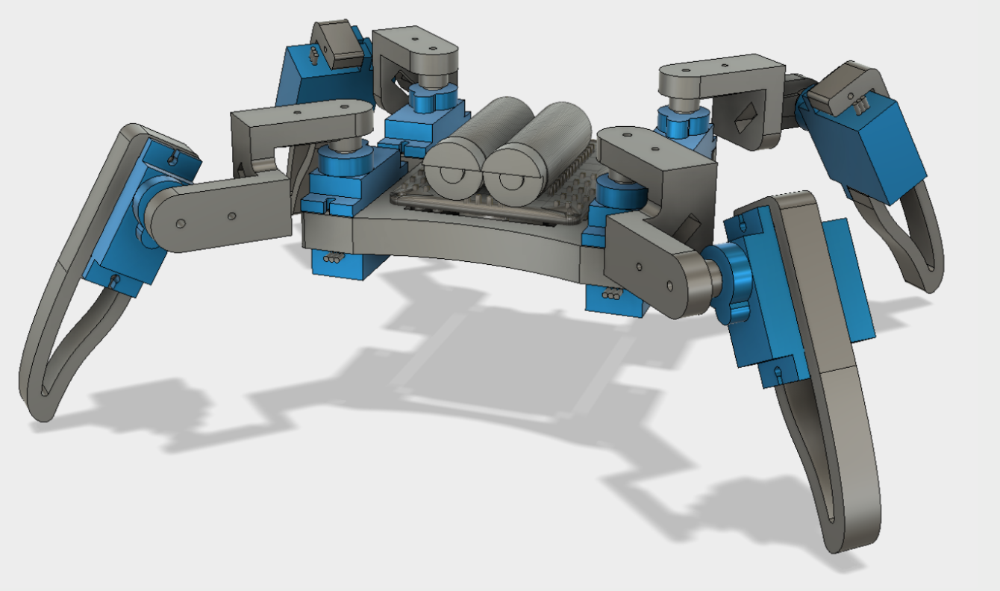

# ESP Quadruped Robot
This is open soruce quadruped robot with 3D Printable files and firmware for ESP8266 (In my case Wemos D1 Mini).

It is based on Jason's Workshop Q1 Mini and Q1 Lite projects:

For firmware components I used:
 * https://github.com/me-no-dev/ESPAsyncWebServer
 * https://github.com/tzapu/WiFiManager
 * https://github.com/esp8266/Arduino/blob/master/libraries/ArduinoOTA/examples/BasicOTA/BasicOTA.ino

## Control Interface
Its based on Bootstrap table with gamepad controls. Should work in offline mode.

## Bill of Materials

### Electronics
* 1x Wemos D1 Mini or alternative
* 8x Servo MG90S or alternative

### 3D Printed
* 1x stl_files/body.stl
* 4x stl_files/foot.stl
* 2x stl_files/thigh.stl (with supports)
* 2x stl_files/thigh_mirror.stl (with supports)

# Changes made from Jason Workshop resources
Simple but brief: I redesigned body and leg stl files. I rewrote firmware for ESP8266 leaving only code responsible for animatronics (moving servos).

Complex but detailed:
[Diff between original-jason-workshop branch and master](https://github.com/ipepe/esp-quadruped-robot/compare/original-jason-workshop...master)

# License

This project licensed under the

Attribution-NonCommercial-ShareAlike 4.0 International (CC BY-NC-SA 4.0)

License Deed

​https://creativecommons.org/licenses/by-nc-sa/4.0/​

​
You are free to:

Share - copy and redistribute the material in any medium or format

Adapt- remix, transform, and build upon the material

The licensor cannot revoke these freedoms as long as you follow the license terms.

​

Under the following terms:

Attribution - You must give appropriate credit, provide a link to the license, and indicate if changes were made. You may do so in any reasonable manner, but not in any way that suggests the licensor endorses you or your use.

NonCommercial - You may not use the material for commercial purposes.

ShareAlike - If you remix, transform, or build upon the material, you must distribute your contributions under the same license as the original.

No additional restrictions - You may not apply legal terms or technological measures that legally restrict others from doing anything the license permits.

​

Credit:

Q1 mini - Quadruped Robot (Designed by Jason Workshop)

Q1 lite - Quadruped Robot (Designed by Jason Workshop)
